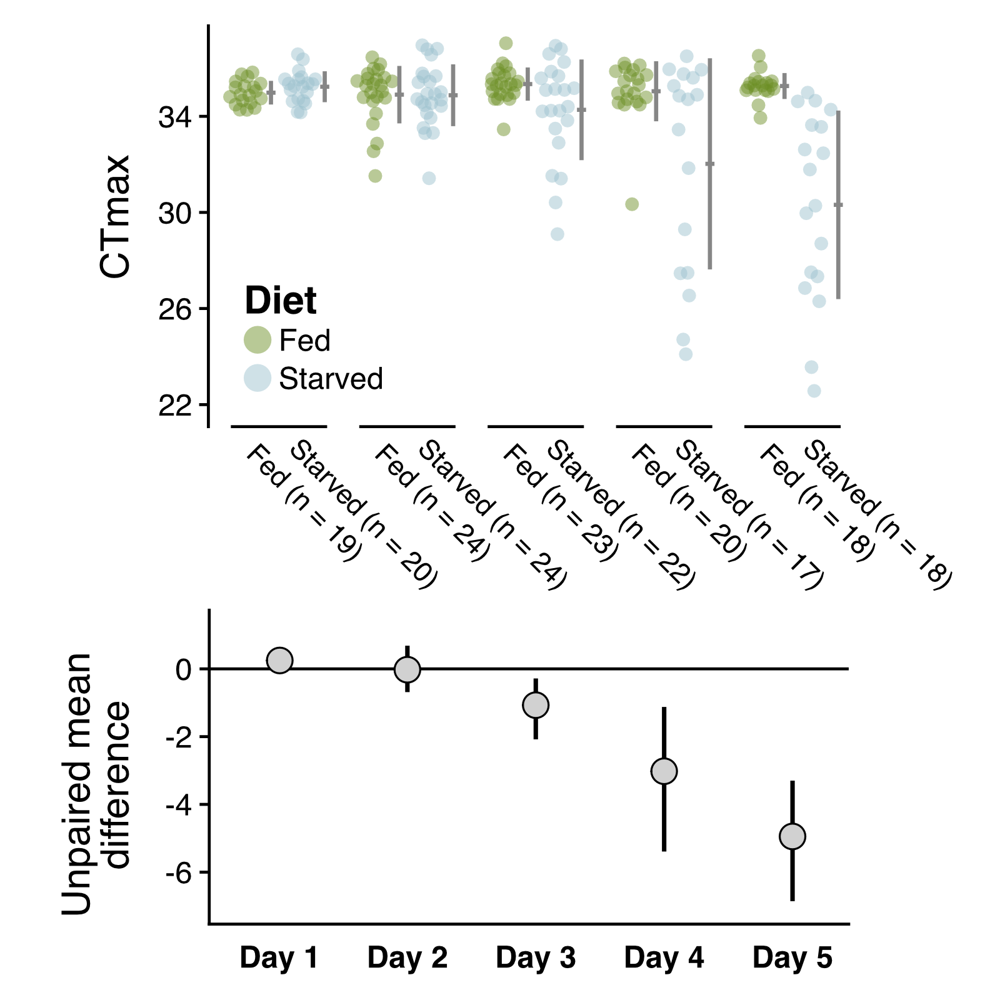

```{r echo = F}
knitr::opts_chunk$set(fig.align = "center")
```

# Introduction

The acquisition of nutrition is a fundamental challenge for organisms. Environmental conditions have well-known effects on the ability to find, capture, and ingest food via a direct influence on organismal performance. Nutrition may also affect how environmental conditions impact organisms, however, by modifying the underlying sensitivity to changes in the experienced environment [@huey2019; @litchman2023]. As anthropogenic climate change is driving long-term ocean warming and increased frequency of disturbances like marine heat waves [@johnston2022; @li2022; @oliver2018; @hobday2016], these feedbacks between feeding and sensitivity to environmental conditions are crucial to consider.

Temperature has strong effects on metabolic rates in ectothermic organisms, linking energetic requirements to the thermal environment [@johnston2022; @brown2004]. We might therefore expect to see increasing consumption pressure on autotrophs and lower trophic levels as ocean warming proceeds, with consequences for community structure and the distribution of biomass [@archibald2022]. In addition to effects of long-term changes in temperature, acute warming events like marine heat waves can threaten the stability of marine ecosystems by exposing marine organisms to temperatures beyond thermal optima [@smale2019; @harvey2022]. The co-occurring nature of changes in food availability and exposure to high temperature highlights the importance of studying interactions between organismal thermal limits and starvation.

The interactions between starvation and upper thermal limits (UTL), however, are still unknown for many taxa. Most studies have focused on terrestrial arthropods, examining species in Diptera [@manenti2018; @gotcha2018; @mitchell2017, @kalra2017], Coleoptera [@chidawanyika2017; @scharf2016], Hymenoptera [@nguyen2017; @gonzalez2022], Hempitera [@devries2016], and Lepidotera [@mutamiswa2018; @mir2018]. There is strong variation in the effects of starvation on UTLs across this work. The duration of starvation may have important effects, with little to no effect of shorter periods [@gonzalez2022; @devries2016] but decreases in UTLs after longer periods [@nguyen2017]. However, even relatively short exposures have been observed to reduce UTLs [@manenti2018; @mir2018]. Further, a number of studies have reported that starvation increases UTLs [@gotcha2018; @mitchell2017; @kalra2017], possibly due to starvation-induced changes in energy allocation. Within aquatic ectotherms, experiments on the freshwater amphipod *Gammarus fossarum* revealed that starvation improved survival during acute heat stress [@semsar-kazerouni2020]. This improvement in UTLs is not observed in fish or octopus systems [@lee2016; @uriarte2018].

The species-specific nature of starvation effects on thermal limits is an important observation for predictions about the response of communities to climate change. Amplifying the direct effects of starvation on thermal limits, @huey2019 describes a process termed 'metabolic meltdown', in which exposure to high temperatures, reduced food intake, and decreasing thermal limits act synergistically to drastically decrease tolerance to a warmer environment. Since a key component of metabolic meltdown is the reduction of thermal limits under reduced food intake, variation in starvation effects across taxa could have strong impacts on the response of community composition and dynamics to climate change.

Copepods are the some of the most abundant animals on the planet, and dominate planktonic communities in the coastal ocean [@turner2004]. By nature of their abundance this group plays key ecological and biogeochemical roles in aquatic systems [@steinberg2017; @pinti2023; @brun2019]. In particular, copepods are important consumers of primary productivity, and act as a crucial linkage between phytoplankton and higher trophic levels [@castonguay2008]. Climate change therefore has the potential to impact aquatic ecosystem functions as well as human fishery systems directly through changes in copepod populations. However, despite their abundance and ecological importance, there is limited data on environmental control of copepod thermal limits, including the effects of starvation. This impedes our ability to predict how copepod populations may be affected by co-occurring changes in temperature and food availability over both short (e.g. - seasonal changes) and long timescales (e.g. - anthropogenic climate change). In this study we tracked changes in critical thermal maxima (CT~max~) in the widespread copepod *Acartia tonsa* during extended starvation to test the hypothesis that food deprivation reduces thermal limits.

# Methods

## Copepod Cultures

The copepods used in this study were collected in July 2020 from Esker Point, Connecticut (41.3206N, -72.002W) by surface tow with a 63-um mesh net and solid cod end. Mature *Acartia tonsa* females and males were isolated from the tow contents, and used to initiate a laboratory culture which was maintained in an environmental chamber at 18°C with a 12:12 light:dark cycle. A small aquarium pump ensured constant aeration. Copepods were fed *ad libitum* a mixture of three phytoplankton cultured in F/2 media under the same environmental conditions: a green flagellate, *Tetraselmis sp.*; the cryptomonad *Rhodomonas sp.*; and the small diatom *Thalassiosira weissflogii*. This diet is regularly used to maintain large, active laboratory cultures of *A. tonsa* [@sasaki2019].

## Measuring Thermal Limits

We used a custom set up to measure critical thermal maxima (CT~max~) of individual copepods, as described in [forthcoming Sasaki et al. paper]. Briefly, this set up includes a reservoir, water bath, and temperature logger (Supp. Fig. 1). The reservoir (a five gallon bucket) holds \~\_ L of water, along with a 300-watt fixed output titanium water heater and two aquarium pumps. One pump vigorously circulates water within the reservoir while the other pumps water up into the water bath, a plexiglass tank that sits atop the reservoir. The water bath contains a series of test tube holders, used to position the experimental vessels (50 ml flat-bottom glass tubes) during the assay. When the pump is turned on, water floods the bath and then spills over back into the reservoir. In this arrangement, temperatures in the experimental vessels are slowly increased at a rate of between 0.1-0.3°C per minute, following temperatures in the reservoir. The final component is a small Arduino logger, which records temperature from three sensors placed inside tubes distributed throughout the water bath.

At the beginning of each CT~max~ trial, the water in the reservoir was adjusted to 18°C. The experimental vessels were filled with 10 mL of 0.2 um filtered sea water before being placed in the water bath, which when flooded brought the experimental vessels to the correct temperature as well. Individual copepods were placed into the vials (n = 10 per assay), and let acclimate for ten minutes at constant temperature. All copepods were checked during this time period for normal behavior. Individuals exhibiting abnormal behaviors were excluded from further analysis. After this resting phase, the water heater was turned on, initiating the temperature ramp. Simultaneously, the temperature logger began to record temperature and a stop watch began recording the time passed. Individuals were continuously monitored as water temperature increased. CT~max~ is generally defined as the temperature at which an individual ceases to respond to physical stimuli [@cowles1944], indicating the onset of "ecological death" (the inability to escape lethal temperatures, predators, etc.). In *A. tonsa* this is indicated by cessation of movement, a lack of response to gentle physical stimuli (e.g. - slow flushing of the water in the tube with a transfer pipette), and abnormal body configuration (specifically - antennules pressed against the sides of prosome and a distinct dorsal tilt of the urosome). The time at which an individual began to exhibit these characteristics was recorded and that individual's experimental vessel removed from the water bath. After all individuals reached their CT~max~, copepods were photographed using a camera attached to an inverted scope (or the equivalent), and body size estimated using a scale micrometer and the software ImageJ (REF).

The times recorded during the trials were converted to CT~max~ values in degrees C using the temperatures recorded on the logging system. As there are between 1-10 vials being monitored at any point in the trial, the time at which an individual was recorded as having stopped responding to stimulus corresponds with the latest time (and therefore highest temperature) it could have reached its CT~max~. The period of time during which an individual could have reached its CT~max~ extends from this definite end point to the last time the individual was checked. As it generally takes around 5 seconds to check whether an individual has stopped responding, the duration of this period of time was estimated for each individual as the number of vials remaining in the water bath multiplied by 5 seconds. As a result, this uncertainty window decreased in length as the trial went on, until, for the final individual, the window includes just the amount of time it took to check whether the individual had stopped responding. For each individual, CT~max~ is estimated as the average temperature recorded by all three temperature sensors throughout the uncertainty window. We used this time-based method instead of directly monitoring the temperatures because i) it was more efficient to record the time than three separate temperature readings, and ii) to reduce any sub-conscious bias stemming from past knowledge or expectations about copepod thermal limits.

## Experimental Design

We used five replicate experiments to test our hypothesis that starvation reduces copepod thermal limits over time. Each experiment involved measuring a baseline CT~max~ for the culture, and then tracking CT~max~ over time in two groups of copepods, a fed control group and a starved treatment group. To initiate each experiment, 10 mature females were isolated from the laboratory culture and maintained for 24 hours in 200 mL of an *ad libitum* food solution (800 ug C / L of *Tetraselmis*). Preliminary work showed that short exposure to three different prey options (*Tetraselmis sp.*, *Rhodomonas sp.*, and *Oxyrrhis marina*, a heterotrophic dinoflagellate) did not affect copepod thermal limits (Supp. Fig. 2). After 24 hours, CT~max~ was measured as described above. This provided an initial baseline value for each experiment.

On the same day as the baseline CT~max~ measurements, \~90 mature females were isolated from the culture and divided into six groups. The six groups were randomly assigned to either the starvation treatment or the fed control treatment. The starvation groups were maintained in 0.2-um filtered sea water. The control group was provided with the food solution used prior to measuring baseline CT~max~ (800 ug C / L of *Tetraselmis*). Each group was kept in a 100 mL cup with a plastic cylinder nested within. The bottom end of the cylinder was covered by a 150-um mesh screen. Similar set-ups are often used to prevent egg cannibalization during egg production assays, as eggs of *A. tonsa* sink through the mesh to the base of the cup [@plough2018]. In our case, this prevented females in the starvation group from acquiring nutrition via egg cannibalism. All groups were transferred to fresh media (either filtered sea water or food solution) on a daily basis throughout the experiment by gently removing the meshed column and placing it into a new 100 mL cup.

Copepods from these six groups were then used to measure thermal limits each day for five days, starting 24 hours after the females were first isolated. Each day, we measured CT~max~ values for ten copepods, selected at random from the six groups. By repeating these measurements over the five day period, we were able to examine how the effects of starvation on CT~max~ changed over time. The second replicate experiment was ended after day three when all individuals from the starvation treatment died. Individuals from replicate experiment five were not photographed after the CT~max~ assays due to a malfunction with the imaging software.

## Statistical Analysis

All statistical analyses were performed with R (Version 4.1.3; R Core Team 2022). The CT~max~ values for the two groups (fed and starved individuals) were compared using mean difference as an effect size estimate. Confidence intervals for this effect size were estimated using non-parametric bootstrapping (Ho et al., 2019). Two sets of effect sizes were estimated. First, we examined the difference between the initial baseline CT~max~ values and CT~max~ values for fed and starved individuals during the experiment (e.g. - the difference between fed CT~max~ and the baseline CT~max~ on each of days one through five). The second effect size was the difference between fed and starved individuals on each day within the experiment. If CT~max~ does not change over time in the fed control group, these two effect sizes will provide similar results.

# Results

The custom setup produced consistent ramping rates across assays (Supp. Fig. 3). Ramping rates did however decrease over time in a consistent way within each assay due to the imperfect insulation of the bucket reservoir. Ramping rates were always between the target ramping rates of 0.1 - 0.3°C per minute, however, which have been used previously to measure CT~max~ for copepods [@sasaki2021; @harada2019; @jiang2009].

A total of `r dim(starv_data)[1]` CT~max~ measurements were made across the five replicate experiments (`r paste(table(starv_data$diet)[1], "from the fed controls and", paste(table(starv_data$diet)[2]), "from the starved treatment", sep = " ")`). Note that the difference between the number of fed and starved individuals reflects the five sets of initial baseline CTmax values measured. No changes were observed between the fed controls and the baseline CT~max~ values during any of the experiments (Supp. Fig. 4). CT~max~ in the starved group, however, gradually decreased over the course of the five day starvation period relative to both the baseline CT~max~ values and the fed controls (Figure 1). There was no difference between thermal limits of fed and starved individuals on days 1 or 2. Thermal limits were approximately 1°C lower by day 3 and continued to decrease by approximately 2°C per day after that. By day 5, starved individuals had thermal limits that were approximately 5°C lower than those of control individuals. There was, however, also a large increase in the variance of individual thermal limits in the starved treatment; several individuals maintained thermal limits similar to those observed in the control individuals while others had thermal limits as low as 22°C. There was no significant effect of body size on CT~max~ during any of the experimental days (Supp. Fig. 5).

```{r model-results, echo = F}
model = lme4::lmer(data = starv_data, ct_max ~ rep_day * diet + (1|rep))
#car::Anova(model, test = "F", type = "III")
```

```{r, figure2, echo = F, out.width = "300px", fig.cap = "Estimation plots depicting the gradual reduction in thermal limits relative in the starvation group relative to the control group."}

```

\newpage

# Discussion

[Summary of results]

[Mechanisms - effects of starvation on HSP expression]

[Implications for population dynamics in a changing climate; Phytoplankton production expected to increase(?) in most regions, potentially limiting starvation effects on thermal limits; However, over shorter timescales (seasonal), the most intense effects of heatwaves and extreme events are expected to be concentrated during time periods when 1) organisms are closest to their thermal limits (summer) and 2) when phytoplankton concentrations/biomass are at their seasonal minimum.]

\newpage

# Supplementary Material

**Supp. Fig. 1** - Schematic of the custom device used to measure copepod CT~max~ values.

```{r supp-fig-1, echo = F, out.width = "300px"}

```

\newpage

**Supp. Fig. 2** - Diet figure.

```{r supp-fig-2, echo = F, out.width = "300px"}
knitr::include_graphics("../Output/Figures/markdown/supp-fig-1-diet-comparison-1.png")
```

\newpage

**Supp. Fig. 3** - Ramping rates during these trials (the increase in temperature per minute) decrease over time due to the imperfect insulation of the bucket reservoir. Ramping rates were always between the target ramping rates of 0.3 and 0.1 degrees C per minute. The plot below is a hexagonal heatmap of ramping rate throughout the CTmax trials. The plane is divided into regular hexagons, which are shaded according the frequency of the encompassed ramping rates.

```{r supp-fig-3, echo = F, out.width = "300px"}
knitr::include_graphics("../Output/Figures/markdown/supp-fig-3-ramping-rates-1.png")
```

\newpage

**Supp. Fig. 4** - CT~max~ vs baseline

```{r supp-fig-4, echo = F, out.width = "300px"}
knitr::include_graphics("../Output/Figures/markdown/supp-fig-4-replicate-effect-sizes-1.png")
```

\newpage

**Supp. Fig. 5** - Thermal limits (CT~max~) plotted against individual body size for each day, separated by treatment. A linear regression is shown, along with the associated p-value for each day. At no point throughout the experimental duration (day 1 through 5) is thermal limit associated with length.

```{r supp-fig-5, echo = F, out.width = "500px"}
knitr::include_graphics("../Output/Figures/markdown/supp-fig-5-ctmax-length-1.png")
```
