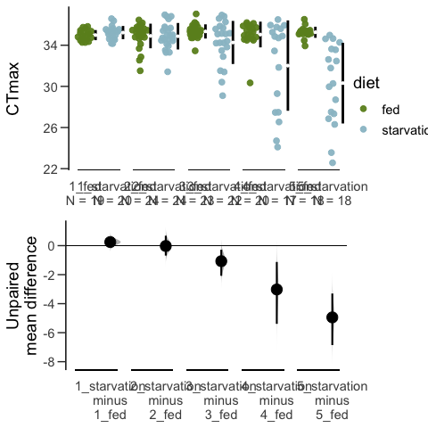
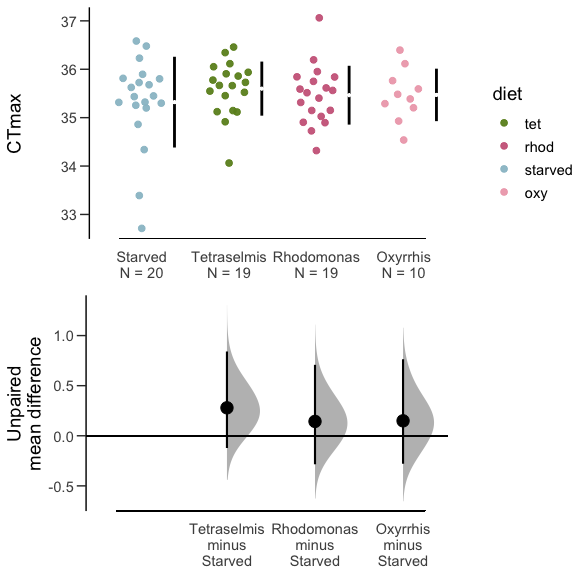
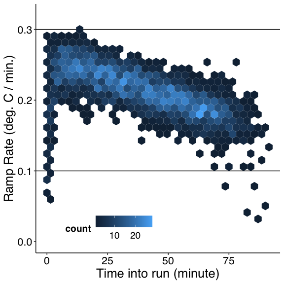
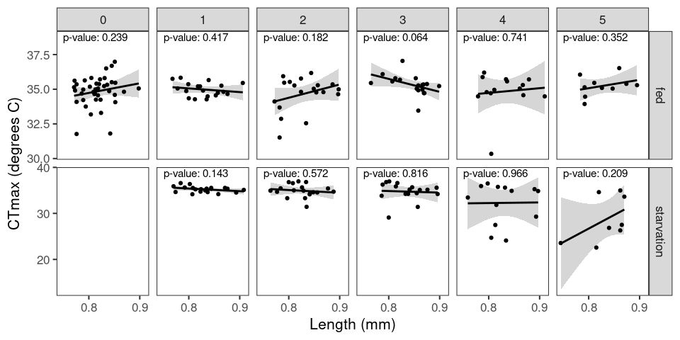

```
## # A tibble: 6 × 4
##   group       sample treatment    corrected_r
##   <chr>        <dbl> <chr>              <dbl>
## 1 disturbed        5 starved_corr    NA      
## 2 disturbed        5 fed_corr        NA      
## 3 undisturbed      5 starved_corr     0.00421
## 4 undisturbed      5 fed_corr         0.00282
## 5 disturbed        6 starved_corr    -0.00589
## 6 disturbed        6 fed_corr        -0.00199
```











